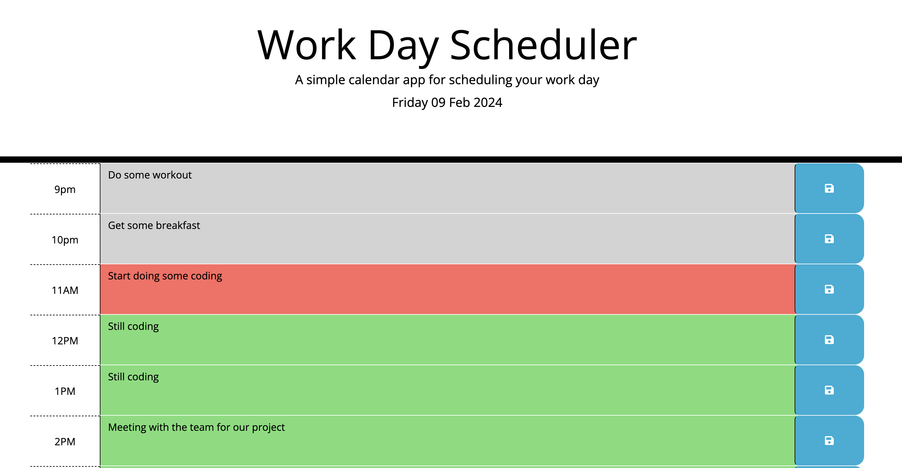
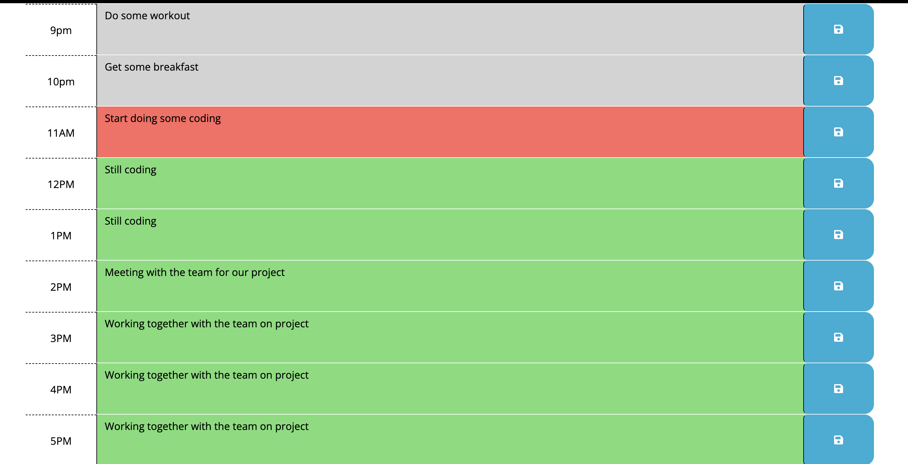

# Work-Day-Scheduler

Daily Planner

## Description 

This is a work day scheduler that allows users save events for each hour of the day in order to manage their time effectively. This app runs in the browser and feature dynamically updated HTML and CSS powered by jQuery.

The Work Day Scheduler, is equipped with a daily update function powered by Day.js. Its color-coded hours and task columns dynamically adjust based on the time of day. 

## Installation

This application is website based and also feature dynamically updte HTML and CSS which is powered by jQuery.

- To access the Work Day Scheduler [follow the link](https://martinokaf.github.io/Work-Day-Scheduler/).
- Open the link on your preferred web browser.
- Explore the website by entering any of your tasks for the day in the text boxes and click the 'save' icon to save your notes.

## Usage 

The current day and date are shown at the top of the calendar when a user opens the planner, and also display timeblocks for regular business hours to the user. 

Each hour of the work day has its own line. Every time block is colour-coded based on the time of the day:

- Grey: past
- Red: present
- Green: future 

As time goes by, the time block's colour is changed, by selecting a time block and entering the event's title, the user can add an event to the scheduler. User can save the event entered on the page to the browser's local storage by clicking on the save button on the same line. The user can click on the time block, remove the event title, and then create a new one in order to change an event.

After that is finished, click the save button on the same line to save the event.The events that have been saved will remain accessible even if the user refreshes the page.

## Credits

Despite being finished independently, the project used the source code from:

- edX Boot Camps LLC
- [JQuery Click Event](https://api.jquery.com/click/#on-) 
- [JavaScript parseInt()](https://www.w3schools.com/JSREF/jsref_parseint.asp) 
- [Window local storage](https://www.w3schools.com/jsref/prop_win_localstorage.asp) 
- [Days.js - JavaScript library (Format)](https://day.js.org/docs/en/display/format#docsNav) 

## License

MIT License - Please see the Repository for more information